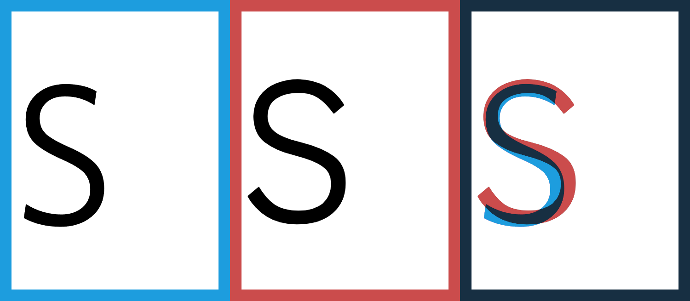

# ggSans-vs-whitney

# Fonts overview

## whitney - (font-weight: 400) [blue border]

Links to images:
[A-Z](assets/images/alphabets/whitney%20A-Z.png), 
[a-z0-9](assets/images/alphabets/whitney%20a-z0-9.png),
[special](assets/images/alphabets/whitney%20special.png)

## gg sans - (font-weight: 400) [red border]

Links to images:
[A-Z](assets/images/alphabets/gg%20A-Z.png),
[a-z0-9](assets/images/alphabets/gg%20a-z0-9.png),
[special](assets/images/alphabets/gg%20special.png)

*Side-note: All images in this repo are screenshots from an HTML file using the original .woff2 font from Discord (03.12.2022)* 
*(font-size: 11rem; line-height: calc(11rem * 1.375) (font-size * 1.375 being the default line-height in Discord as of now))*

# Anatomy comparison (Baseline, Height, Cap)

## whitney

Links to images:
[A-Z](assets/images/lines/whitney%20A-Z%20lines.png),
[a-z0-9](assets/images/lines/whitney%20a-z0-9%20lines.png)

## gg sans

Links to images:
[A-Z](assets/images/lines/gg%20A-Z%20lines.png),
[a-z0-9](assets/images/lines/gg%20a-z0-9%20lines.png)

*Side-note: viewing those images inside an app like photoshop or similar where you can zoom to pixel level is recommended here*

# Anatomy comparison (width)

## whitney

Links to images:
[a-z](assets/images/width/whitney%20a-z.png),
[A-Z](assets/images/width/whitney%20big%20a-z.png)

## gg sans

Links to images:
[a-z](assets/images/width/gg%20a-z.png),
[A-Z](assets/images/width/gg%20big%20a-z.png)

# Letter by letter comparison

 
 
 
 
 
 
 
 
 
 
 
 
 
 
 
 
 
 
 
 
 
 
 
 
 
